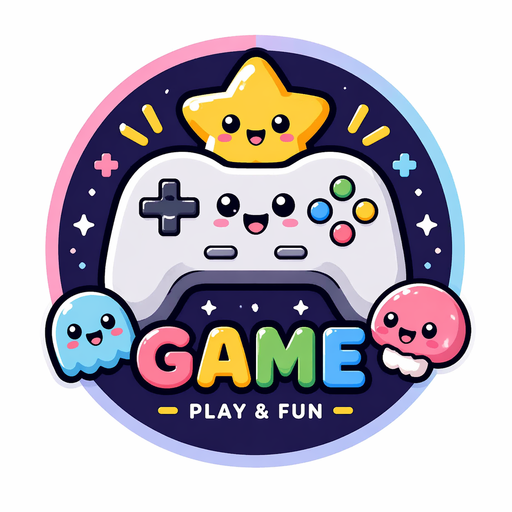

# 人工智慧期中報告

## 👤 基本資料
班級：___  
學號：___  
姓名：___  

---

## 🎮 遊戲畫面
（之後放截圖）

---

## 🎨 Logo

---

## 💻 程式碼
<!DOCTYPE html>
<html>
<head>
    <meta charset="UTF-8">
    <title>可愛點擊遊戲</title>
    
</head>

<body>

<h1>🎮 可愛點擊遊戲 🎮</h1>

分數：0

時間：10 秒

<button onclick="addScore()">點我！</button>

<h2 id="result"></h2>

</body>
</html>
